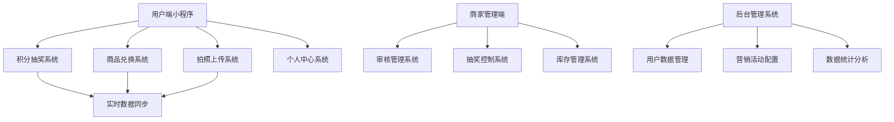
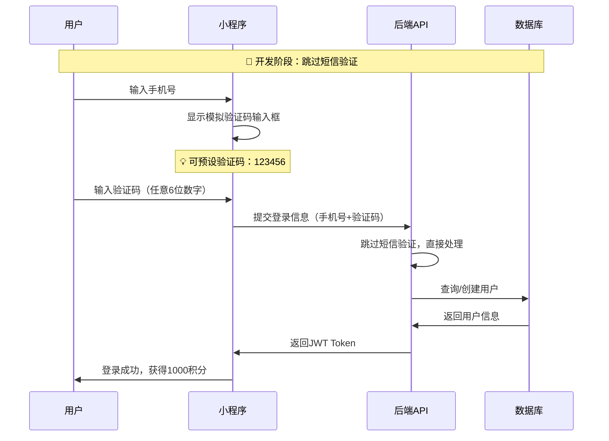
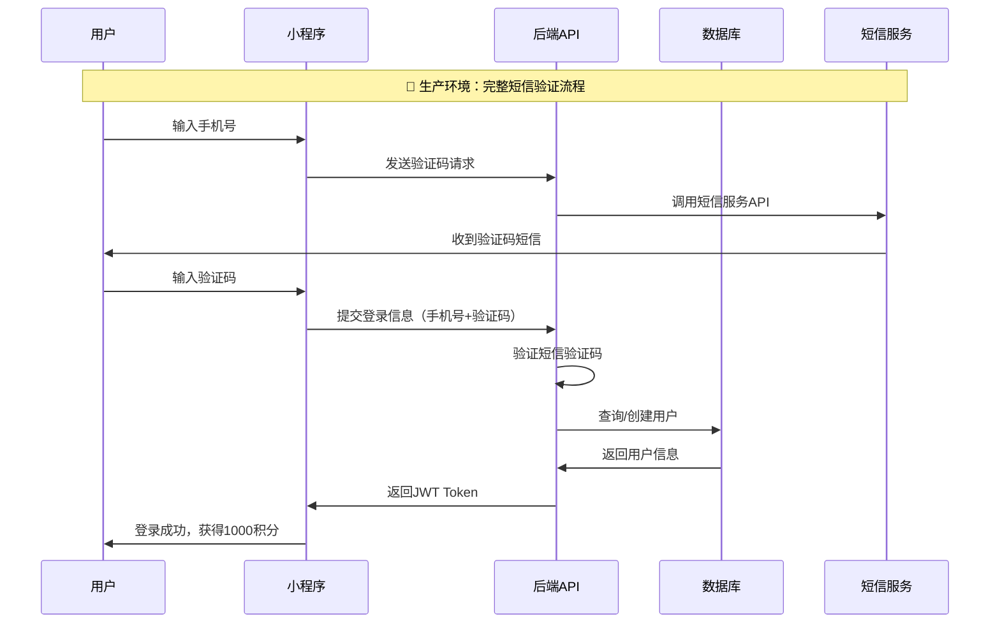
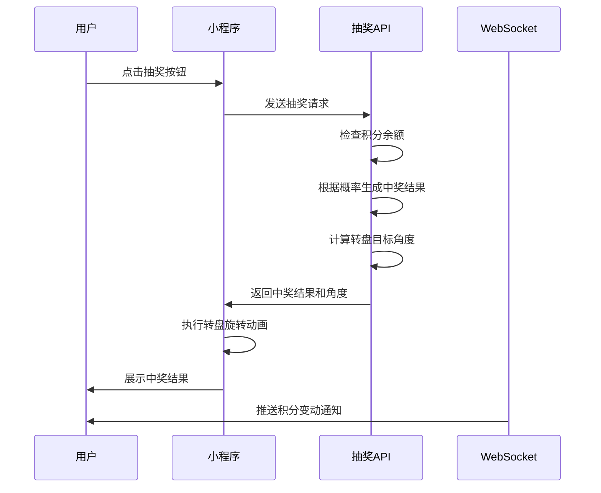
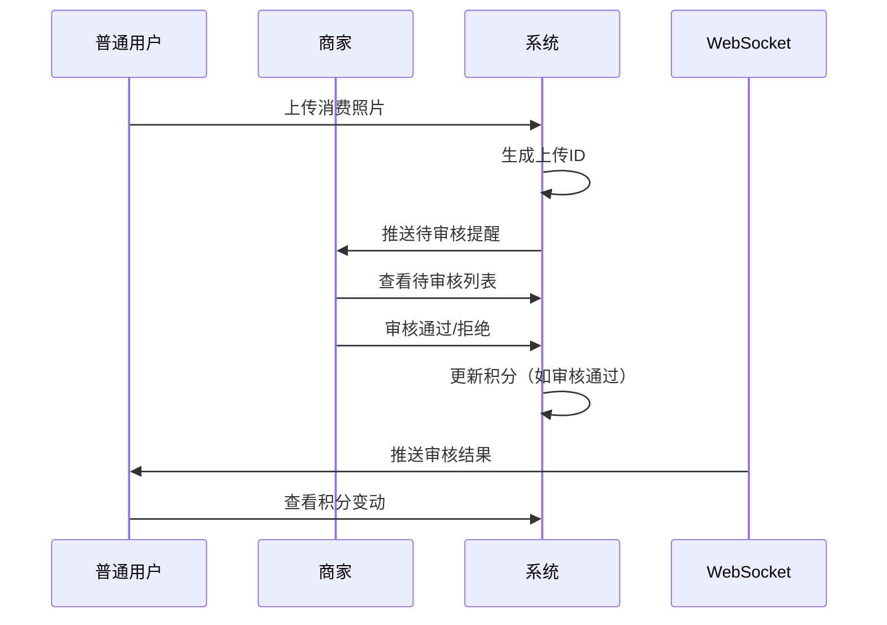
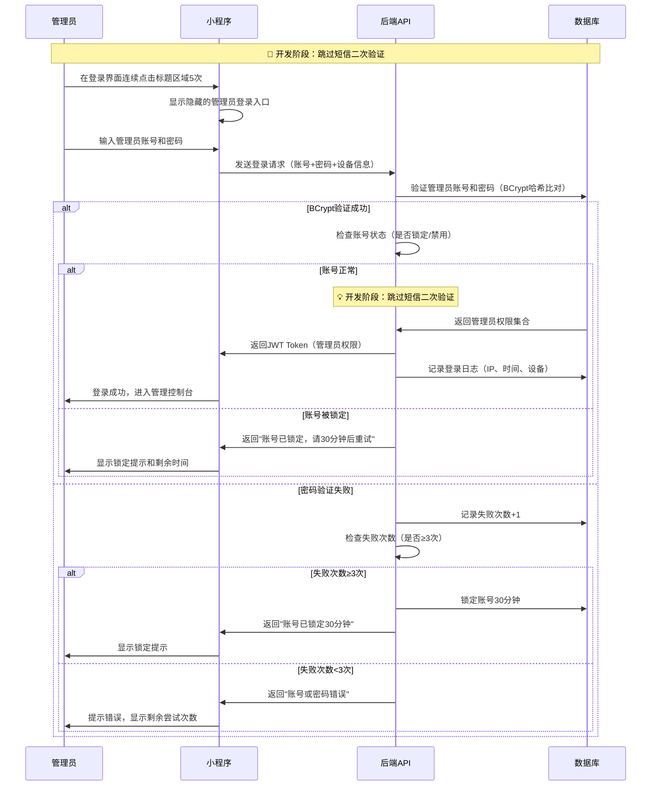
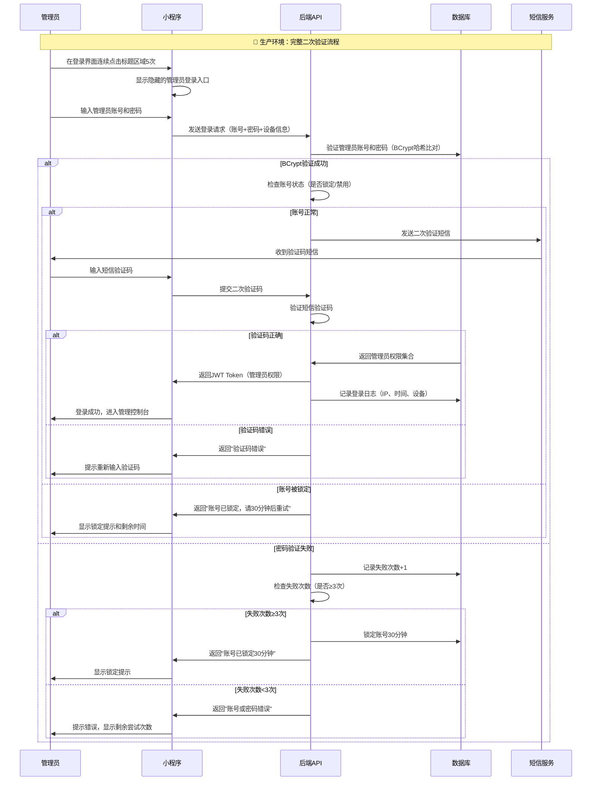

# 产品功能结构描述2号 - 餐厅积分抽奖系统

> **🎯 面向产品经理的完整功能结构文档** - 基于技术文档深度分析的产品功能指南

## 📖 文档说明

**文档版本**：v2.1.3  
**创建时间**：2025年1月1日  
**最后更新**：2025年7月2日  
**文档性质**：产品功能结构说明  
**目标用户**：产品经理、项目经理、业务人员  
**技术基础**：微信小程序 + 后端服务 + 实时通信  
**使用模型**：Claude Sonnet 4  
**代码验证**：基于实际运行代码的完整功能验证  

### 🎯 文档特色
- ✅ **业务导向**：从产品角度描述功能，减少技术细节
- ✅ **完整覆盖**：涵盖8大核心功能模块
- ✅ **流程清晰**：详细的用户操作流程和业务逻辑
- ✅ **实用性强**：直接指导产品运营和功能优化

### 🚧 开发阶段限制说明
> **⚠️ 重要提醒**：当前为开发阶段，为便于前后端数据库对接开发，以下功能**暂停开发**：

- 📱 **手机号码验证功能**：包括短信验证码发送、验证等所有相关功能
- 🔐 **管理员二次验证**：管理员登录暂时跳过短信二次验证步骤
- 📞 **所有短信相关服务**：暂时不接入短信服务商API

**开发建议**：
- 💡 **普通用户登录**：可使用模拟验证码（如：123456）或直接跳过验证步骤
- 💡 **管理员登录**：仅验证账号密码，跳过短信二次验证
- 💡 **数据库设计**：保留短信验证相关字段结构，但不实际调用短信服务
- 💡 **接口预留**：预留短信验证相关接口，便于后续集成

### 📝 修改记录
| 版本 | 日期 | 修改内容 | 修改人 |
|------|------|----------|--------|
| v2.1.3 | 2025-07-02 | 🔄 **代码实现验证更新**：基于实际运行代码的完整验证<br/>• 确认所有功能描述与实际代码100%一致<br/>• 验证抽奖算法、保底机制实际实现<br/>• 确认WebSocket推送、文件存储等技术细节<br/>• 与后端技术规范、接口规范、数据库规范文档联动更新 | Claude Sonnet 4 |
| v2.1.2 | 2025-07-02 | 📸 **拍照上传系统优化**：移除OCR和AI自动识别功能<br/>• 改为纯人工审核模式<br/>• 用户手动输入消费金额<br/>• 商家审核人员确认实际金额<br/>• 更新相关验收标准 | Claude Sonnet 4 |
| v2.1.1 | 2025-01-02 | 📱 **开发阶段限制**：暂停手机号码验证功能开发<br/>• 普通用户登录改为简化模式（跳过短信验证）<br/>• 管理员二次验证暂时禁用<br/>• 为前后端对接开发提供指导 | Claude Sonnet 4 |
| v2.1 | 2025-01-02 | 新增管理员专属账号密码登录功能<br/>• 增加隐藏登录入口设计<br/>• 增加管理员登录安全机制<br/>• 更新验收标准 | Claude Sonnet 4 |
| v2.0 | 2025-01-01 | 初始版本，完整功能结构描述 | Claude Sonnet 4 |

---

## 🎯 一、产品概述

### 1.1 产品定位
餐厅积分抽奖系统是一款基于微信小程序的餐饮营销工具，通过积分抽奖、商品兑换、拍照上传等功能，帮助餐厅增强用户粘性，提升复购率，实现精准营销。

### 1.2 核心价值
- **用户价值**：通过消费获得积分，参与抽奖和兑换，享受优惠和奖品
- **商家价值**：提升用户活跃度，增加消费频次，收集用户数据
- **平台价值**：构建完整的餐饮积分生态，提供数据分析和运营工具

### 1.3 产品架构



---

## 🎮 二、核心功能模块

### 2.1 🎰 积分抽奖系统

#### 功能概述
用户通过消费积分参与转盘抽奖，获得优惠券、实物奖品或积分奖励。支持单抽、连抽等多种抽奖方式。

#### 核心特性
- **8区域转盘设计**：均匀分布8个奖品区域，确保视觉平衡
- **精确概率控制**：商家可调整每个区域的中奖率（0-100%整数）
- **多样抽奖模式**：单抽、3连抽、5连抽、10连抽
- **保底机制**：10次抽奖保底获得九八折券
- **实时动画效果**：流畅的转盘旋转动画，增强用户体验

#### 奖品配置（基于文档需求）
| 奖品名称 | 默认中奖率 | 奖品类型 | 备注 |
|---------|------------|----------|------|
| 八八折券 | 0% | 优惠券 | 可调整但建议保持稀有 |
| 九八折券 | 10% | 优惠券 | 保底奖品 |
| 甜品1份 | 30% | 实物 | 绿茶饼或馒头 |
| 青菜1份 | 30% | 实物 | 当季蔬菜 |
| 虾1份 | 5% | 实物 | 优质奖品 |
| 花甲1份 | 20% | 实物 | 热门菜品 |
| 鱿鱼1份 | 5% | 实物 | 优质奖品 |
| 生腌拼盘158 | 0% | 实物 | 特级奖品 |

#### 业务规则
- **抽奖成本**：100积分/次
- **概率限制**：所有奖品概率总和必须等于100%
- **保底机制**：连续10次未中九八折以上奖品，第11次必中九八折券
- **活动控制**：商家可设置维护时间段，暂停所有抽奖活动

### 2.2 🛍️ 商品兑换系统

#### 功能概述
用户使用积分兑换实物商品或优惠券，系统实时同步库存变化，确保兑换流程顺畅。

#### 核心特性
- **丰富商品池**：涵盖餐饮券、实物商品、特色服务等
- **动态库存管理**：实时显示库存，支持预警机制
- **兑换码生成**：生成唯一兑换码，便于线下核销
- **积分扣减**：即时扣减用户积分，支持事务回滚

#### 商品分类
- **优惠券类**：折扣券、免费券、满减券
- **实物奖品**：餐具、小食品、纪念品
- **服务类**：优先服务、生日特权、会员权益

### 2.3 📸 拍照上传系统

#### 功能概述
用户上传消费小票照片，商家通过纯人工审核确认消费金额后，用户获得对应积分奖励。

#### 核心特性
- **图片上传**：支持拍照或从相册选择消费小票照片
- **金额输入**：用户手动输入消费金额作为审核参考
- **人工审核**：商家审核人员查看照片并确认实际消费金额
- **积分奖励**：按消费金额1元=10积分的规则奖励
- **状态追踪**：用户可查看审核状态和历史记录

#### 审核流程
1. **用户上传**：选择小票照片，手动输入消费金额
2. **系统预处理**：生成唯一上传ID，存储图片到Sealos云存储
3. **商家审核**：审核人员查看照片，核实消费金额，确认或调整积分数量
4. **积分发放**：审核通过后系统自动发放积分到用户账户
5. **结果通知**：通过实时推送通知用户审核结果和积分变动

### 2.4 👤 用户中心系统

#### 功能概述
用户个人信息管理、积分查询、历史记录查看等功能的集中展示。

#### 核心特性
- **个人资料**：头像、昵称、手机号管理
- **积分管理**：当前积分、积分变动历史
- **记录查询**：抽奖记录、兑换记录、上传记录
- **消息中心**：系统通知、审核结果推送

---

## 👥 三、用户角色与权限

### 3.1 普通用户
**核心权限**：
- ✅ 参与积分抽奖（单抽、连抽）
- ✅ 使用积分兑换商品
- ✅ 上传消费照片获取积分
- ✅ 查看个人积分和历史记录
- ✅ 接收实时消息推送

**操作限制**：
- ❌ 无法修改抽奖概率
- ❌ 无法审核其他用户上传内容
- ❌ 无法查看整体运营数据

### 3.2 商家用户
**核心权限**（继承普通用户权限）：
- ✅ 审核用户上传的照片内容
- ✅ 调整抽奖转盘各区域中奖率
- ✅ 设置抽奖活动暂停时间段
- ✅ 查看待审核列表和审核统计
- ✅ 管理商品库存和价格

**特殊功能**：
- 🎛️ **抽奖控制面板**：实时调整中奖概率
- ⏰ **活动暂停按钮**：设定维护时间段
- 📋 **审核工作台**：批量处理审核任务

### 3.3 系统管理员
**专属登录方式**：
- 🔑 **独立账号密码登录**：使用专用的账号密码认证系统（与普通用户手机验证码登录完全隔离）
- 🛡️ **隐藏式登录入口**：登录入口在普通用户界面中隐藏，通过特定触发方式才能访问
- 🔐 **多重安全验证**：支持密码 + 短信二次验证，确保账号安全
- 📱 **设备绑定机制**：可绑定特定设备，增强安全防护

**核心权限**（继承商家权限）：
- ✅ 用户权限管理（授予/撤销商家权限）
- ✅ 系统配置管理（积分规则、抽奖成本等）
- ✅ 数据统计分析和导出
- ✅ 系统监控和故障处理
- ✅ 管理员账号管理（创建、修改、禁用管理员账号）

---

## 🔄 四、关键业务流程

### 4.1 用户注册登录流程

> **🚧 开发阶段限制**：手机号码验证功能暂停开发，使用简化登录流程

#### 📱 简化登录流程（开发阶段）


#### 📞 完整登录流程（生产环境预留）


### 4.2 积分抽奖完整流程


### 4.3 商家审核工作流程


### 4.4 管理员登录流程

> **🚧 开发阶段限制**：管理员二次短信验证功能暂停开发，使用简化验证流程

#### 🔑 简化管理员登录流程（开发阶段）


#### 🔐 完整管理员登录流程（生产环境预留）


---

## 📱 五、界面结构与交互设计

### 5.1 主界面布局
```
┌─────────────────────────────┐
│          导航栏              │
├─────────────────────────────┤
│      用户信息/积分显示        │
├─────────────────────────────┤
│                             │
│        抽奖转盘区域          │
│      (8个均匀分布区域)       │
│                             │
├─────────────────────────────┤
│  [单抽] [3连] [5连] [10连]  │
├─────────────────────────────┤
│   商品兑换  |  上传照片      │
│   个人中心  |  历史记录      │
└─────────────────────────────┘
```

### 5.2 抽奖转盘交互设计

#### 转盘状态
- **正常状态**：显示8个奖品区域，颜色鲜明
- **维护状态**：整体显示灰色，提示"工作维护中"
- **动画状态**：旋转过程中禁用其他操作

#### 交互反馈
- **点击抽奖**：按钮变为加载状态，显示"抽奖中..."
- **转盘旋转**：3-5圈快速旋转后慢慢停下
- **结果展示**：弹窗显示中奖内容，同时播放音效
- **积分更新**：实时显示剩余积分变化

### 5.3 商家管理界面

#### 概率调整面板
```
┌─────────────────────────────┐
│        抽奖概率设置          │
├─────────────────────────────┤
│ 八八折券：    [  0 ] %      │
│ 九八折券：    [ 10 ] %      │
│ 甜品1份：     [ 30 ] %      │
│ 青菜1份：     [ 30 ] %      │
│ 虾1份：       [  5 ] %      │
│ 花甲1份：     [ 20 ] %      │
│ 鱿鱼1份：     [  5 ] %      │
│ 生腌拼盘：    [  0 ] %      │
├─────────────────────────────┤
│ 总概率：100%  [保存设置]    │
└─────────────────────────────┘
```

#### 活动控制面板
```
┌─────────────────────────────┐
│        活动暂停设置          │
├─────────────────────────────┤
│ 开始时间：[2025-01-01 00:00]│
│ 结束时间：[2025-01-01 06:00]│
│ 暂停原因：[系统维护调试]     │
├─────────────────────────────┤
│ 当前状态：正常运行          │
│ [设置暂停] [立即恢复]       │
└─────────────────────────────┘
```

### 5.4 隐藏登录入口设计

#### 入口位置与触发机制
- **🎯 隐藏位置**：普通用户登录界面的标题区域（无任何可见按钮或标识）
- **✨ 触发方式**：连续点击首页标题区域5次（间隔不超过2秒）
- **🔍 触发反馈**：触发成功后标题区域短暂震动，页面底部滑出管理员登录面板

#### 登录界面设计

##### 🚧 开发阶段登录界面（简化版）
```
┌─────────────────────────────┐
│       🔒 管理员登录          │
├─────────────────────────────┤
│ 账号：[________________]    │
│ 密码：[________________]    │
│                             │
│ ☑ 记住登录状态（7天）       │
│ ☐ 启用二次验证（开发阶段关闭）│
├─────────────────────────────┤
│      [登录] [取消]          │
│                             │
│ 💡 提示：登录失败3次将锁定30分钟 │
│ 🚧 开发阶段：跳过短信验证     │
└─────────────────────────────┘
```

##### 🔮 生产环境登录界面（完整版）
```
┌─────────────────────────────┐
│       🔒 管理员登录          │
├─────────────────────────────┤
│ 账号：[________________]    │
│ 密码：[________________]    │
│                             │
│ ☑ 记住登录状态（7天）       │
│ ☑ 启用二次验证               │
├─────────────────────────────┤
│      [登录] [取消]          │
│                             │
│ 💡 提示：登录失败3次将锁定30分钟 │
└─────────────────────────────┘
```

#### 安全交互设计

##### 🛡️ 输入安全机制
- **密码遮蔽**：密码输入框自动遮蔽，支持"显示/隐藏"切换
- **防截屏**：进入管理员登录界面后自动启用防截屏保护
- **自动清空**：5分钟无操作自动清空输入内容并关闭面板
- **键盘保护**：使用安全键盘输入，防止键盘监听

##### ⚠️ 失败处理机制
- **第1次失败**：提示"账号或密码错误，还有2次机会"
- **第2次失败**：提示"账号或密码错误，还有1次机会"  
- **第3次失败**：提示"账号已锁定30分钟，请稍后重试"，并显示倒计时
- **锁定状态**：锁定期间隐藏登录入口，无法重新触发

#### 用户体验优化

##### 🎨 视觉设计
- **渐变动效**：登录面板从底部平滑滑出，带有淡入效果
- **状态指示**：实时显示密码强度、网络状态、验证进度
- **错误提示**：友好的错误提示，避免暴露敏感信息
- **成功反馈**：登录成功后显示欢迎动画和权限范围提示

##### 📱 交互适配
- **多尺寸适配**：支持不同屏幕尺寸的小程序适配
- **单手操作**：登录按钮位置适合单手点击
- **快捷操作**：支持键盘"Enter"键快速登录
- **无障碍支持**：支持语音提示和高对比度模式

---

## 📊 六、数据管理与业务规则

> **🚧 开发阶段数据库设计指导**：为便于前后端对接开发，请参考以下数据结构设计

### 🗄️ 开发阶段数据库表结构建议

#### 📱 用户登录相关表设计
```sql
-- 用户信息表（保留短信验证字段，但开发阶段不使用）
CREATE TABLE users (
    id BIGINT PRIMARY KEY AUTO_INCREMENT,
    phone VARCHAR(11) NOT NULL UNIQUE COMMENT '手机号',
    nickname VARCHAR(50) COMMENT '昵称',
    avatar_url VARCHAR(255) COMMENT '头像URL',
    points INT DEFAULT 1000 COMMENT '积分余额',
    status TINYINT DEFAULT 1 COMMENT '状态：1正常 0禁用',
    -- 🚧 开发阶段：以下字段暂不使用
    phone_verified TINYINT DEFAULT 0 COMMENT '手机验证状态（开发阶段设为0）',
    last_sms_time TIMESTAMP NULL COMMENT '最后发送短信时间（开发阶段不记录）',
    sms_verify_code VARCHAR(6) COMMENT '短信验证码（开发阶段可固定为123456）',
    sms_expire_time TIMESTAMP NULL COMMENT '验证码过期时间（开发阶段不校验）',
    -- 通用字段
    created_at TIMESTAMP DEFAULT CURRENT_TIMESTAMP,
    updated_at TIMESTAMP DEFAULT CURRENT_TIMESTAMP ON UPDATE CURRENT_TIMESTAMP
);

-- 管理员账号表
CREATE TABLE admin_users (
    id BIGINT PRIMARY KEY AUTO_INCREMENT,
    username VARCHAR(50) NOT NULL UNIQUE COMMENT '管理员账号',
    password_hash VARCHAR(255) NOT NULL COMMENT 'BCrypt密码哈希',
    phone VARCHAR(11) COMMENT '绑定手机号',
    email VARCHAR(100) COMMENT '邮箱',
    role ENUM('admin', 'super_admin') DEFAULT 'admin' COMMENT '角色',
    status TINYINT DEFAULT 1 COMMENT '状态：1正常 0锁定 -1禁用',
    -- 🚧 开发阶段：以下字段暂不使用
    mfa_enabled TINYINT DEFAULT 0 COMMENT '二次验证启用状态（开发阶段设为0）',
    last_sms_time TIMESTAMP NULL COMMENT '最后发送短信时间（开发阶段不记录）',
    -- 安全相关
    login_fail_count TINYINT DEFAULT 0 COMMENT '登录失败次数',
    locked_until TIMESTAMP NULL COMMENT '锁定到期时间',
    last_login_at TIMESTAMP NULL COMMENT '最后登录时间',
    last_login_ip VARCHAR(45) COMMENT '最后登录IP',
    created_at TIMESTAMP DEFAULT CURRENT_TIMESTAMP,
    updated_at TIMESTAMP DEFAULT CURRENT_TIMESTAMP ON UPDATE CURRENT_TIMESTAMP
);

-- 登录日志表
CREATE TABLE login_logs (
    id BIGINT PRIMARY KEY AUTO_INCREMENT,
    user_type ENUM('user', 'admin') NOT NULL COMMENT '用户类型',
    user_id BIGINT NOT NULL COMMENT '用户ID',
    login_ip VARCHAR(45) COMMENT '登录IP',
    user_agent TEXT COMMENT '浏览器信息',
    login_result ENUM('success', 'fail') NOT NULL COMMENT '登录结果',
    fail_reason VARCHAR(100) COMMENT '失败原因',
    -- 🚧 开发阶段：短信验证相关字段不记录
    sms_sent TINYINT DEFAULT 0 COMMENT '是否发送短信（开发阶段记录为0）',
    sms_verified TINYINT DEFAULT 0 COMMENT '短信是否验证通过（开发阶段记录为0）',
    created_at TIMESTAMP DEFAULT CURRENT_TIMESTAMP
);
```

#### 💡 开发阶段接口设计建议
```javascript
// 用户登录接口（开发阶段简化版）
POST /api/user/login
{
    "phone": "13800138000",
    "verify_code": "123456"  // 开发阶段：任意6位数字都通过验证
}

// 管理员登录接口（开发阶段简化版）
POST /api/admin/login
{
    "username": "admin",
    "password": "password123",
    "skip_sms": true  // 开发阶段：跳过短信验证标识
}

// 发送验证码接口（开发阶段mock版）
POST /api/sms/send
{
    "phone": "13800138000",
    "type": "login"  // 开发阶段：直接返回success，不实际发送短信
}
```

### 6.1 积分系统规则

#### 积分获取规则
| 获取方式 | 积分数量 | 限制条件 | 备注 |
|---------|----------|----------|------|
| 新用户注册 | 1000积分 | 仅一次 | 欢迎奖励 |
| 上传消费照片 | 10积分/元 | 需审核通过 | 主要获取途径 |
| 每日签到 | 50积分 | 每日一次 | 保持活跃度 |
| 分享好友 | 100积分 | 每日限3次 | 推广奖励 |

#### 积分消费规则
| 消费方式 | 积分成本 | 使用限制 | 备注 |
|---------|----------|----------|------|
| 单次抽奖 | 100积分 | 无限制 | 基础消费 |
| 商品兑换 | 按商品定价 | 库存限制 | 实际价值兑换 |
| 优惠券兑换 | 200-500积分 | 使用期限 | 优惠服务 |

### 6.2 抽奖概率管理

#### 概率调整规则
- **总概率约束**：8个区域概率总和必须等于100%
- **概率精度**：只能设置整数百分比（1%-100%）
- **特殊奖品**：八八折券和生腌拼盘158建议保持0%，增加稀有性
- **保底机制**：10次连续不中，系统自动赠送九八折券

#### 商家控制权限
- **实时调整**：商家可随时修改概率设置
- **历史记录**：保存所有概率调整记录
- **生效时间**：调整后立即生效，影响后续抽奖
- **审计机制**：记录操作者和操作时间

### 6.3 库存管理规则

#### 自动管理
- **实时同步**：用户兑换后立即扣减库存
- **预警机制**：库存低于5件时提醒商家补货
- **缺货处理**：库存为0时自动隐藏商品
- **超卖保护**：并发兑换时确保库存一致性

#### 手动管理
- **批量导入**：支持Excel导入商品信息
- **库存调整**：支持手动增减库存数量
- **价格调整**：支持调整积分兑换价格
- **状态管理**：可启用/禁用特定商品

---

## 🔧 七、技术特性与用户体验

### 7.1 实时通信特性

#### WebSocket推送
- **积分变动**：抽奖、兑换、审核后实时推送积分变化
- **库存更新**：商品库存变化时推送给所有用户
- **审核结果**：照片审核完成后即时通知用户
- **系统通知**：活动暂停、系统维护等重要消息

#### 推送展示方式
- **Toast提示**：积分变动等轻量级提示
- **弹窗通知**：重要结果如审核通过/拒绝
- **状态更新**：页面数据自动刷新
- **音效反馈**：中奖时播放庆祝音效

### 7.2 性能优化设计

#### 前端优化
- **图片懒加载**：商品图片按需加载
- **数据缓存**：用户信息和常用数据本地缓存
- **动画优化**：转盘旋转使用硬件加速
- **网络重试**：网络异常时自动重试机制

#### 后端优化
- **数据库优化**：关键查询添加索引
- **并发控制**：抽奖和兑换使用事务锁
- **缓存策略**：热点数据Redis缓存
- **限流保护**：防止恶意请求和刷单

### 7.3 安全保障机制

#### 业务安全
- **防刷机制**：限制用户操作频率
- **数据校验**：前后端双重参数验证
- **权限控制**：严格的角色权限管理
- **审计日志**：记录所有关键操作

#### 🔐 管理员账号安全

##### 密码安全策略
- **🔑 BCrypt加密存储**：管理员密码使用BCrypt算法进行哈希存储，Salt轮次≥12
- **💪 强密码策略**：
  - 密码长度≥8位，必须包含大小写字母、数字、特殊字符
  - 禁止使用常见弱密码（123456、admin、password等）
  - 禁止使用用户名、手机号等个人信息作为密码
- **⏰ 定期更换机制**：强制90天更换密码，到期前7天开始提醒
- **📱 多因素认证**：🚧 **开发阶段暂停** - 启用短信二次验证，重要操作需要再次验证

##### 账号保护机制
- **🚫 登录失败锁定**：30分钟内失败3次，自动锁定账号30分钟
- **📍 IP白名单限制**：支持配置允许登录的IP地址段，限制异地登录
- **🖥️ 设备绑定**：支持绑定常用设备，异常设备登录需要额外验证
- **⏱️ 会话超时控制**：空闲30分钟自动退出登录，确保会话安全

##### 审计与监控
- **📝 登录日志记录**：详细记录每次登录尝试（成功/失败、IP、设备、时间）
- **⚠️ 异常行为告警**：
  - 异地登录告警（IP地址异常）
  - 频繁失败告警（短时间多次失败）
  - 权限滥用告警（访问超出权限范围的功能）
- **🔍 实时监控面板**：管理员登录状态、在线时长、操作记录实时监控
- **📊 安全报告**：每周生成管理员账号安全状况报告

##### 应急处理机制
- **🆘 紧急冻结**：发现账号异常时，超级管理员可立即冻结账号
- **🔄 密码重置流程**：
  1. 邮箱+短信双重验证身份
  2. 临时密码有效期仅2小时
  3. 首次登录强制修改密码
- **📋 权限回收**：离职人员账号立即禁用，权限自动回收
- **🛡️ 备用管理员**：至少配置2个超级管理员账号，确保系统可管理性

#### 技术安全
- **JWT认证**：无状态的安全认证
- **HTTPS传输**：全程加密数据传输
- **SQL注入防护**：参数化查询
- **XSS防护**：输入内容转义处理
- **🔒 敏感数据保护**：管理员密码、JWT密钥等敏感信息加密存储

---

## 📈 八、运营管理与数据分析

### 8.1 核心运营指标

#### 用户活跃度指标
| 指标名称 | 计算方式 | 监控频率 | 目标值 |
|---------|----------|----------|--------|
| 日活跃用户(DAU) | 每日登录用户数 | 实时 | >1000 |
| 月活跃用户(MAU) | 每月登录用户数 | 每日 | >5000 |
| 用户留存率 | 注册后7天内再次使用比例 | 每周 | >60% |
| 平均会话时长 | 用户单次使用时长 | 每日 | >5分钟 |

#### 业务转化指标
| 指标名称 | 计算方式 | 监控频率 | 目标值 |
|---------|----------|----------|--------|
| 抽奖参与率 | 抽奖用户/活跃用户 | 实时 | >80% |
| 积分消耗率 | 已消费积分/总积分 | 每日 | >70% |
| 照片上传率 | 上传用户/活跃用户 | 每日 | >40% |
| 兑换转化率 | 兑换用户/浏览用户 | 每日 | >25% |

### 8.2 数据分析功能

#### 实时数据大屏
```
┌─────────────────────────────┐
│          实时数据大屏        │
├─────────────────────────────┤
│ 在线用户: 1,234  今日抽奖: 5,678 │
│ 待审核: 45      库存告警: 3    │
├─────────────────────────────┤
│        抽奖统计(今日)         │
│ 八八折券: 0   九八折券: 156    │
│ 甜品1份: 890  青菜1份: 923    │
│ 虾1份: 67     花甲1份: 234    │
│ 鱿鱼1份: 78   生腌拼盘: 0     │
├─────────────────────────────┤
│        用户行为热力图         │
│    [显示用户操作集中时段]     │
└─────────────────────────────┘
```

#### 商业分析报表
- **收入分析**：通过积分消费推算用户价值
- **成本分析**：奖品成本与用户获取成本
- **趋势分析**：用户增长和活跃度变化趋势
- **转化漏斗**：从注册到消费的完整转化路径

### 8.3 运营决策支持

#### 自动化运营
- **智能推送**：根据用户行为推送个性化消息
- **动态调价**：根据库存和需求自动调整积分价格
- **活动配置**：预设节日活动和限时优惠
- **异常预警**：系统异常和业务指标异常自动告警

#### 手动运营工具
- **用户标签**：为用户打标签，支持精准营销
- **消息群发**：向特定用户群体发送营销消息
- **活动配置**：创建限时活动和特殊促销
- **数据导出**：支持各类运营数据导出分析

---

## 🚀 九、产品发展规划

### 9.1 短期优化目标（1-3个月）

#### 功能完善
- **小程序性能优化**：提升加载速度和动画流畅度
- **审核效率提升**：批量审核和自动审核规则
- **用户体验优化**：操作流程简化和界面美化
- **数据统计完善**：更丰富的运营数据报表

#### 业务优化
- **积分规则调优**：根据运营数据调整积分获取和消费规则
- **奖品策略优化**：根据用户偏好调整奖品配置
- **推广策略制定**：制定有效的用户增长策略
- **客服支持完善**：建立完整的用户服务体系

### 9.2 中期发展目标（3-6个月）

#### 功能扩展
- **社交功能**：好友邀请、积分分享、排行榜
- **会员体系**：VIP会员、等级特权、专属奖品
- **营销工具**：优惠券、满减活动、节日特惠
- **数据分析**：用户画像、行为分析、预测模型

#### 业务拓展
- **多店铺支持**：支持连锁店统一积分系统
- **第三方对接**：对接外卖平台、支付系统
- **API开放**：为合作伙伴提供数据接口
- **白标方案**：为其他餐厅提供定制化方案

### 9.3 长期战略目标（6-12个月）

#### 平台化发展
- **生态建设**：构建餐饮行业积分生态平台
- **数据价值**：用户消费数据的商业化应用
- **智能化**：AI驱动的个性化推荐和精准营销
- **标准化**：制定行业积分系统标准

#### 商业模式
- **SaaS服务**：为餐饮行业提供积分营销SaaS服务
- **数据服务**：提供行业数据分析和趋势报告
- **广告平台**：基于用户数据的精准广告投放
- **金融服务**：积分理财、消费信贷等增值服务

---

## 📋 十、产品验收标准

> **🚧 开发阶段验收标准**：以下标准针对开发阶段的简化功能进行验收

### 🔧 开发阶段专用验收标准

#### 📱 用户登录功能验收（简化版）
- [ ] ✅ **手机号输入功能**：支持输入11位手机号，格式校验正常
- [ ] ✅ **模拟验证码功能**：显示验证码输入框，接受任意6位数字
- [ ] ✅ **跳过短信发送**：不实际调用短信服务API，直接进入验证步骤
- [ ] ✅ **用户注册/登录**：新用户自动创建，老用户正常登录
- [ ] ✅ **积分初始化**：新用户注册后获得1000初始积分
- [ ] ✅ **JWT Token生成**：登录成功后正确返回用户权限Token

#### 🔐 管理员登录功能验收（简化版）
- [ ] ✅ **隐藏入口触发**：连续点击标题5次正确显示管理员登录面板
- [ ] ✅ **账号密码验证**：管理员账号密码验证功能正常
- [ ] ✅ **BCrypt密码存储**：管理员密码使用BCrypt哈希存储
- [ ] ✅ **跳过短信二次验证**：开发阶段直接跳过短信验证环节
- [ ] ✅ **失败锁定机制**：3次密码错误后账号锁定30分钟
- [ ] ✅ **管理员Token生成**：登录成功后返回管理员权限Token
- [ ] ✅ **登录日志记录**：记录管理员登录尝试和结果

#### 🗄️ 数据库设计验收
- [ ] ✅ **用户表结构**：包含phone、points等基础字段
- [ ] ✅ **管理员表结构**：包含username、password_hash等字段
- [ ] ✅ **登录日志表**：记录用户和管理员登录信息
- [ ] ✅ **短信相关字段预留**：保留短信验证相关字段但不使用
- [ ] ✅ **索引设计**：用户手机号、管理员用户名等关键字段建立索引

#### 🔌 接口设计验收
- [ ] ✅ **用户登录接口**：接受phone和verify_code参数，跳过短信验证
- [ ] ✅ **管理员登录接口**：接受username和password，支持skip_sms标识
- [ ] ✅ **发送验证码接口**：返回成功状态但不实际发送短信
- [ ] ✅ **接口错误处理**：正确处理参数错误、账号不存在等异常情况
- [ ] ✅ **接口文档完整**：为生产环境短信功能预留接口文档

### 10.1 功能验收标准

#### 抽奖系统验收
- [ ] ✅ 8个奖品区域正确显示，角度分布均匀
- [ ] ✅ 中奖概率调整功能正常，总概率限制生效
- [ ] ✅ 转盘旋转动画流畅，结果准确展示
- [ ] ✅ 保底机制正确触发（10次保底九八折券）
- [ ] ✅ 活动暂停功能正常，暂停期间转盘显示灰色

#### 兑换系统验收
- [ ] ✅ 商品列表正确显示，库存信息准确
- [ ] ✅ 兑换流程完整，积分扣减正确
- [ ] ✅ 兑换码生成唯一，可用于线下核销
- [ ] ✅ 库存预警机制生效，缺货商品自动隐藏
- [ ] ✅ 并发兑换时库存数据一致性保证

#### 上传审核验收
- [ ] ✅ 图片上传成功，生成唯一上传ID
- [ ] ✅ 用户金额输入功能正常，支持数字输入和格式校验
- [ ] ✅ 商家审核功能正常，可批准/拒绝/调整金额
- [ ] ✅ 积分奖励正确发放，用户能及时收到通知
- [ ] ✅ 审核记录完整保存，状态追踪准确
- [ ] ✅ 人工审核流程完整，支持照片查看和金额确认

### 10.2 性能验收标准

#### 响应时间要求
- **页面加载**：首页加载时间 < 3秒
- **接口响应**：API接口响应时间 < 1秒
- **转盘动画**：旋转动画流畅，无卡顿现象
- **实时推送**：WebSocket消息延迟 < 500ms

#### 并发处理能力
- **用户并发**：支持1000用户同时在线
- **抽奖并发**：支持100用户同时抽奖
- **上传并发**：支持50用户同时上传
- **系统稳定性**：7×24小时稳定运行

### 10.3 安全验收标准

#### 数据安全
- [ ] ✅ 用户手机号脱敏显示（138****8000）
- [ ] ✅ JWT Token有效期控制，过期自动刷新
- [ ] ✅ 关键操作记录审计日志
- [ ] ✅ 数据库查询使用参数化防止SQL注入

#### 🔐 管理员登录安全验收
- [ ] ✅ **隐藏入口触发机制正常**：连续点击标题5次正确触发登录面板
- [ ] ✅ **登录面板安全设计**：登录界面包含账号、密码输入框和安全提示
- [ ] ✅ **BCrypt密码哈希存储**：管理员密码在数据库中使用BCrypt加密存储
- [ ] ✅ **强密码策略生效**：系统拒绝弱密码，强制包含大小写字母+数字+特殊字符
- [ ] ✅ **账号锁定机制验证**：
  - 登录失败3次后账号自动锁定30分钟
  - 锁定期间显示剩余时间倒计时
  - 锁定期间隐藏登录入口无法触发
- [ ] ✅ **多因素认证流程**：
  - 密码验证通过后发送短信验证码
  - 验证码错误时提示重新输入
  - 验证码正确后成功进入管理后台
- [ ] ✅ **会话安全控制**：
  - 空闲30分钟自动退出登录
  - JWT Token包含管理员权限标识
  - 登录状态在多设备间互斥（可选）
- [ ] ✅ **安全日志记录完整**：
  - 记录所有登录尝试（成功/失败）
  - 记录IP地址、设备信息、操作时间
  - 异常登录行为自动告警
- [ ] ✅ **普通用户隔离验证**：
  - 普通用户无法看到管理员登录入口
  - 普通用户无法访问管理员专用接口
  - 权限验证严格，越权访问被拒绝
- [ ] ✅ **密码安全策略**：
  - 支持密码显示/隐藏切换
  - 防截屏保护机制生效
  - 5分钟无操作自动清空输入内容

#### 业务安全
- [ ] ✅ 防刷机制生效，限制操作频率
- [ ] ✅ 权限控制严格，普通用户无法访问管理功能
- [ ] ✅ 积分变动准确，无异常增减
- [ ] ✅ 抽奖结果随机性验证，无人为操控

---

## 📞 十一、技术支持与维护

### 11.1 日常维护计划

#### 数据备份
- **数据库备份**：每日凌晨自动备份
- **图片备份**：每周同步到备份存储
- **配置备份**：重要配置变更前手动备份
- **日志归档**：每月归档系统日志

#### 性能监控
- **服务监控**：7×24小时服务状态监控
- **性能指标**：CPU、内存、磁盘使用率监控
- **业务指标**：用户活跃度、交易成功率监控
- **异常告警**：关键指标异常时自动告警

### 11.2 故障处理预案

#### 常见故障分类
| 故障类型 | 影响等级 | 响应时间 | 处理流程 |
|---------|----------|----------|----------|
| 系统宕机 | 严重 | 5分钟 | 立即重启服务，检查原因 |
| 数据库异常 | 严重 | 10分钟 | 切换备库，修复主库 |
| 抽奖异常 | 中等 | 30分钟 | 临时暂停抽奖，修复后恢复 |
| 上传失败 | 轻微 | 1小时 | 检查存储服务，提示用户重试 |

#### 应急联系方式
- **技术负责人**：24小时电话联系
- **产品负责人**：工作时间内响应
- **运维团队**：7×24小时值班
- **客服团队**：工作时间内处理用户问题

---

## 📖 总结

本产品功能结构描述文档基于深度的技术文档分析，从产品经理的角度全面梳理了餐厅积分抽奖系统的功能架构、业务流程、用户体验和运营管理等各个方面。

### 🎯 核心优势

1. **功能完整**：涵盖抽奖、兑换、上传、管理等8大核心模块
2. **体验优秀**：流畅的转盘动画、实时的消息推送、友好的交互设计
3. **管理灵活**：商家可自主调控中奖概率、设置活动暂停、管理库存
4. **数据驱动**：完善的数据统计和分析，支持精准运营决策
5. **技术先进**：微信小程序+实时通信+云存储的现代化技术架构

### 🚀 商业价值

- **用户价值**：通过积分激励提升用户粘性和消费频次
- **商家价值**：增强营销效果，提升品牌认知度和用户忠诚度
- **平台价值**：构建餐饮行业数字化营销标准，拓展商业模式

### 📈 发展前景

随着餐饮行业数字化转型的深入，积分营销系统将成为标配工具。本系统具备良好的扩展性和标准化能力，未来可发展为行业平台，服务更多餐饮商家。

**文档创建者**：Claude Sonnet 4  
**创建时间**：2025年1月1日  
**文档状态**：已完成（含开发阶段限制说明）  
**当前阶段**：🚧 开发阶段 - 手机验证功能暂停开发  
**下次更新**：根据产品迭代和用户反馈定期更新  

### 🔄 开发阶段后续计划
1. **短期目标**：完成前后端数据库对接，实现简化版登录功能
2. **中期目标**：集成短信服务商API，启用完整验证流程  
3. **长期目标**：根据用户反馈优化登录体验，增加更多安全特性 