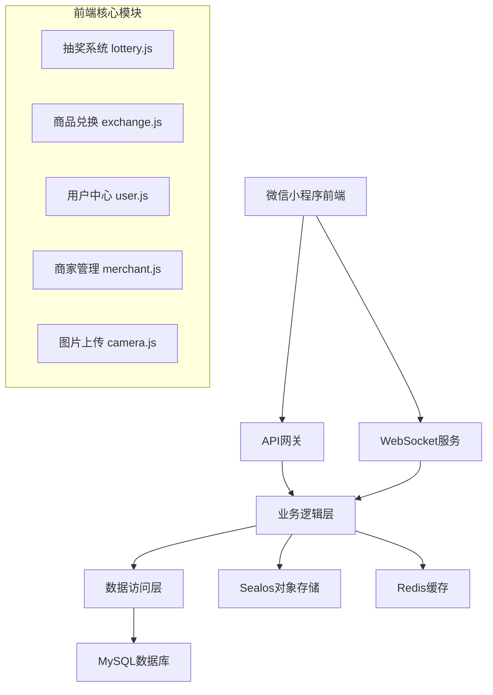

# 餐厅积分抽奖系统 - 前端2号开发文档

> **🚀 专业级前后端对接完整指南** - 基于项目代码深度分析的实战开发文档

## 📖 文档说明

**文档版本**：v2.0  
**创建时间**：2024年12月19日  
**适用场景**：前后端对接开发、数据库设计、API接口实现  
**技术栈**：微信小程序 + Node.js + MySQL + WebSocket + Sealos云存储  
**模型版本**：Claude Sonnet 4 ⚡

### 🎯 文档特色
- ✅ **基于真实代码分析**：所有示例来自项目实际代码
- ✅ **完整对接方案**：涵盖8大核心模块全链路对接
- ✅ **数据库字段映射**：精确的前后端数据结构对应
- ✅ **实战性强**：提供可直接使用的代码和配置

---

## 🏛️ 一、项目架构与核心对接点

### 1.1 整体架构设计



### 1.2 🔴 核心文件对接架构

```javascript
// 项目核心对接文件结构
tiangongqianduan/
├── config/
│   └── env.js                    // 🔴 环境配置中心 - 后端服务地址配置
├── utils/
│   ├── api.js                    // 🔴 API接口封装 - 所有后端接口调用
│   ├── ws.js                     // 🔴 WebSocket管理 - 实时通信
│   └── validate.js               // 数据验证工具
├── pages/
│   ├── lottery/lottery.js        // 🔴 抽奖业务逻辑 - 核心功能模块
│   ├── exchange/exchange.js      // 🔴 商品兑换逻辑 - 库存管理
│   ├── user/user.js             // 🔴 用户中心逻辑 - 积分管理
│   ├── merchant/merchant.js     // 🔴 商家管理逻辑 - 审核流程
│   └── camera/camera.js         // 🔴 图片上传逻辑 - 文件处理
└── app.js                       // 🔴 全局配置 - 认证与WebSocket
```

---

## ⚙️ 二、环境配置与部署对接

### 2.1 🔴 多环境配置系统 (config/env.js)

```javascript
// config/env.js - 关键对接配置
const ENV = {
  // 🟢 开发环境配置
  development: {
    baseUrl: 'http://localhost:3000/api',    // 🔴 后端API地址
    wsUrl: 'ws://localhost:8080',            // 🔴 WebSocket服务地址
    sealosConfig: {                          // 🔴 对象存储配置
      endpoint: 'https://objectstorageapi.bja.sealos.run',
      bucket: 'tiangong',
      accessKeyId: 'br0za7uc',              // 🚨 生产环境需替换
      secretAccessKey: 'skxg8mk5gqfhf9xz',  // 🚨 生产环境需替换
      region: 'bja'
    },
    wechat: {                               // 🔴 微信小程序配置
      appId: 'wx0db69ddd264f9b81',
      appSecret: '414c5f5dc5404b4f7a1662dd26b532f9'
    },
    isDev: true,                            // 🔴 开发模式标记
    needAuth: false                         // 🔴 开发环境跳过认证
  },
  
  // 🟡 测试环境配置
  testing: {
    baseUrl: 'https://rqchrlqndora.sealosbja.site/api',
    wsUrl: 'wss://rqchrlqndora.sealosbja.site/ws',
    isDev: false,
    needAuth: true                          // 🔴 测试环境需要认证
  },
  
  // 🔴 生产环境配置
  production: {
    baseUrl: 'https://rqchrlqndora.sealosbja.site/api',
    wsUrl: 'wss://rqchrlqndora.sealosbja.site/ws',
    isDev: false,
    needAuth: true                          // 🔴 生产环境强制认证
  }
}

// 🚨 部署时必须修改此处
let CURRENT_ENV = 'development'             // 🔴 部署关键点

module.exports = {
  getConfig: () => ENV[CURRENT_ENV],
  setEnv: (env) => CURRENT_ENV = env,
  getCurrentEnv: () => CURRENT_ENV
}
```

### 2.2 🔴 全局配置初始化 (app.js)

```javascript
// app.js - 核心对接逻辑
App({
  onLaunch() {
    this.initSystem()  // 🔴 系统初始化入口
  },

  initSystem() {
    this.initGlobalData()      // 初始化全局数据
    this.initEnvironmentConfig() // 🔴 环境配置加载
    this.initWebSocket()       // 🔴 WebSocket管理器初始化
    this.checkLoginStatus()    // 🔴 登录状态检查
  },

  // 🔴 数据库字段映射配置 - 关键对接信息
  globalData: {
    // 🔴 后端数据库字段映射表
    dbFieldMapping: {
      user: {                               // 🔴 users表字段映射
        id: 'user_id',                     // 前端：id -> 后端：user_id
        mobile: 'mobile',                   // 前端：mobile -> 后端：mobile
        points: 'total_points',            // 🔴 积分字段映射
        isMerchant: 'is_merchant',         // 🔴 商家权限字段
        nickname: 'nickname',
        avatar: 'avatar',
        wxOpenid: 'wx_openid',
        status: 'status',
        createdAt: 'created_at'
      },
      lottery: {                            // 🔴 lottery_prizes表字段映射
        prizeId: 'prize_id',
        prizeName: 'prize_name',
        angle: 'angle',                     // 🔴 Canvas转盘角度字段
        color: 'color',                     // 🔴 转盘扇形颜色字段
        probability: 'probability',         // 🔴 中奖概率字段
        costPoints: 'cost_points'           // 🔴 抽奖消耗积分
      },
      product: {                            // 🔴 products表字段映射
        id: 'commodity_id',
        exchangePoints: 'exchange_points',  // 🔴 兑换积分字段
        stock: 'stock',                     // 🔴 库存字段 - WebSocket同步
        category: 'category',               // 🔴 商品分类字段
        isHot: 'is_hot'                    // 🔴 热门商品标记
      },
      uploadReview: {                       // 🔴 upload_reviews表字段映射
        uploadId: 'upload_id',              // 🔴 上传记录唯一标识
        reviewStatus: 'review_status',      // 🔴 审核状态字段
        pointsAwarded: 'points_awarded'     // 🔴 奖励积分字段
      }
    }
  },

  // 🔴 WebSocket连接建立
  connectWebSocket() {
    if (this.globalData.wsManager && this.globalData.accessToken) {
      // 构建符合后端规范的WebSocket URL
      const wsUrl = `${this.globalData.wsUrl}?token=${this.globalData.accessToken}&client_type=miniprogram`
      this.globalData.wsManager.connect(wsUrl)
    }
  }
})
```

### 2.3 🔴 部署配置检查清单

#### 🚨 生产环境部署必检项
```bash
# 1. 环境配置检查
✅ config/env.js 中 CURRENT_ENV = 'production'
✅ baseUrl 指向生产服务器地址
✅ wsUrl 使用 wss:// 协议
✅ Sealos存储密钥已更新
✅ 微信小程序 appId/appSecret 已配置

# 2. 后端服务地址验证
curl -X GET https://rqchrlqndora.sealosbja.site/api/health
# 期望返回: {"status": "ok", "timestamp": "..."}

# 3. WebSocket服务验证
wscat -c wss://rqchrlqndora.sealosbja.site/ws?token=test
# 期望建立连接成功
```

---

## 🔌 三、API接口完整对接方案

### 3.1 🔴 智能API调用系统 (utils/api.js)

```javascript
// utils/api.js - 核心对接逻辑
const app = getApp()

/**
 * 🔴 智能API调用机制 - 开发/生产环境自动切换
 */
const shouldUseMock = () => {
  return app.globalData.isDev && !app.globalData.needAuth
}

/**
 * 🔴 统一网络请求封装 - 支持自动重试和Token刷新
 */
const request = (options) => {
  return new Promise((resolve, reject) => {
    const {
      url,
      method = 'GET',
      data = {},
      needAuth = true,          // 🔴 是否需要认证
      showLoading = true,       // 🔴 是否显示加载框
      retryCount = 0,          // 🔴 重试计数
      maxRetry = 2             // 🔴 最大重试次数
    } = options

    // 🔴 构建请求头
    const header = {
      'Content-Type': 'application/json'
    }

    // 🔴 自动添加认证头
    if (needAuth && app.globalData.accessToken) {
      header['Authorization'] = `Bearer ${app.globalData.accessToken}`
    }

    const fullUrl = app.globalData.baseUrl + url

    wx.request({
      url: fullUrl,
      method,
      data,
      header,
      success(res) {
        console.log(`📡 API请求 ${method} ${url}:`, {
          request: data,
          response: res.data,
          status: res.statusCode
        })

        // 🔴 统一状态码处理
        if (res.statusCode === 200) {
          if (res.data.code === 0) {
            resolve(res.data)
          } else if (res.data.code === 401) {
            // 🔴 Token过期自动刷新逻辑
            if (retryCount < maxRetry) {
              app.refreshToken().then(() => {
                const newOptions = { ...options, retryCount: retryCount + 1 }
                request(newOptions).then(resolve).catch(reject)
              }).catch(() => {
                app.logout()
                reject(res.data)
              })
            }
          } else {
            // 🔴 业务错误统一处理
            const errorMessage = res.data.msg || res.data.message || '操作失败'
            if (showLoading) {
              wx.showToast({
                title: errorMessage,
                icon: 'none',
                duration: 2000
              })
            }
            reject(res.data)
          }
        }
      },
      fail(err) {
        // 🔴 网络错误处理
        console.error(`❌ API请求失败 ${method} ${url}:`, err)
        if (showLoading) {
          wx.showToast({
            title: '网络请求失败',
            icon: 'none'
          })
        }
        reject(err)
      }
    })
  })
}
```

### 3.2 🔴 核心业务API接口定义

#### 认证模块API (authAPI)
```javascript
const authAPI = {
  /**
   * 🔴 发送短信验证码
   * 接口：POST /api/auth/send-code
   * 参数：{ mobile: "13800138000" }
   * 返回：{ code: 0, message: "验证码发送成功" }
   */
  sendCode(mobile) {
    return request({
      url: '/auth/send-code',
      method: 'POST',
      data: { mobile },
      needAuth: false
    })
  },

  /**
   * 🔴 手机登录注册
   * 接口：POST /api/auth/login
   * 参数：{ mobile: "13800138000", code: "123456" }
   * 返回：{
   *   code: 0,
   *   data: {
   *     access_token: "eyJ...",     // 🔴 访问令牌
   *     refresh_token: "eyJ...",    // 🔴 刷新令牌
   *     expires_in: 7200,           // 🔴 令牌有效期(秒)
   *     user_info: {                // 🔴 用户信息
   *       user_id: 123,
   *       mobile: "13800138000",
   *       total_points: 1500,       // 🔴 用户积分
   *       is_merchant: false        // 🔴 商家权限
   *     }
   *   }
   * }
   */
  login(mobile, code) {
    return request({
      url: '/auth/login',
      method: 'POST',
      data: { mobile, code },
      needAuth: false
    })
  },

  /**
   * 🔴 刷新访问令牌
   * 接口：POST /api/auth/refresh
   * 请求头：Authorization: Bearer {refresh_token}
   */
  refresh(refreshToken) {
    return request({
      url: '/auth/refresh',
      method: 'POST',
      data: { refresh_token: refreshToken },
      needAuth: false
    })
  }
}
```

#### 抽奖模块API (lotteryAPI)
```javascript
const lotteryAPI = {
  /**
   * 🔴 获取抽奖配置
   * 接口：GET /api/lottery/config
   * 返回：{
   *   code: 0,
   *   data: {
   *     prizes: [
   *       {
   *         prize_id: 1,
   *         prize_name: "八八折券",
   *         angle: 0,              // 🔴 Canvas转盘角度(0-315,步长45)
   *         color: "#FF6B35",      // 🔴 扇形颜色(十六进制)
   *         probability: 0.05,     // 🔴 中奖概率(0-1)
   *         prize_type: "coupon",
   *         prize_value: 0.88
   *       }
   *     ],
   *     cost_points: 100,          // 🔴 单次抽奖消耗积分
   *     daily_limit: 10            // 🔴 每日抽奖次数限制
   *   }
   * }
   */
  getConfig() {
    return request({
      url: '/lottery/config',
      method: 'GET'
    })
  },

  /**
   * 🔴 执行抽奖
   * 接口：POST /api/lottery/draw
   * 参数：{ draw_type: "single", count: 1 }
   * 返回：{
   *   code: 0,
   *   data: {
   *     results: [
   *       {
   *         prize_id: 1,
   *         prize_name: "八八折券",
   *         angle: 42.5,           // 🔴 最终停止角度
   *         is_near_miss: false    // 🔴 是否差点中奖
   *       }
   *     ],
   *     remaining_points: 1400,    // 🔴 剩余积分
   *     today_draw_count: 3        // 🔴 今日抽奖次数
   *   }
   * }
   */
  draw(drawType = 'single', count = 1) {
    return request({
      url: '/lottery/draw',
      method: 'POST',
      data: { draw_type: drawType, count }
    })
  }
}
```

---

## 📊 四、数据库字段精确映射

### 4.1 🔴 用户表 (users) 字段映射

```sql
-- 🔴 users表结构设计
CREATE TABLE users (
  user_id INT PRIMARY KEY AUTO_INCREMENT,      -- 🔴 前端: userInfo.user_id
  mobile VARCHAR(11) UNIQUE NOT NULL,          -- 🔴 前端: userInfo.mobile (脱敏显示)
  total_points INT DEFAULT 0,                  -- 🔴 前端: totalPoints (实时同步)
  is_merchant BOOLEAN DEFAULT FALSE,           -- 🔴 前端: userInfo.is_merchant
  nickname VARCHAR(50),                        -- 🔴 前端: userInfo.nickname
  avatar VARCHAR(255),                         -- 🔴 前端: userInfo.avatar
  wx_openid VARCHAR(100),                      -- 微信OpenID
  last_login TIMESTAMP,                        -- 最后登录时间
  status ENUM('active', 'banned') DEFAULT 'active',
  created_at TIMESTAMP DEFAULT CURRENT_TIMESTAMP,
  updated_at TIMESTAMP DEFAULT CURRENT_TIMESTAMP ON UPDATE CURRENT_TIMESTAMP,
  
  INDEX idx_mobile (mobile),
  INDEX idx_openid (wx_openid),
  INDEX idx_points (total_points)
);
```

**🔴 前端对接要点：**
```javascript
// 用户信息数据结构映射
const userMapping = {
  // 前端字段 -> 数据库字段
  'userInfo.user_id': 'users.user_id',
  'userInfo.mobile': 'users.mobile',           // 显示时需脱敏: 138****8000
  'totalPoints': 'users.total_points',         // WebSocket实时同步
  'userInfo.is_merchant': 'users.is_merchant', // 控制页面功能显示
  'userInfo.nickname': 'users.nickname',
  'userInfo.avatar': 'users.avatar'
}
```

### 4.2 🔴 抽奖奖品表 (lottery_prizes) 字段映射

```sql
-- 🔴 lottery_prizes表结构设计
CREATE TABLE lottery_prizes (
  prize_id INT PRIMARY KEY AUTO_INCREMENT,
  prize_name VARCHAR(100) NOT NULL,            -- 🔴 前端: prizes[].name
  prize_type ENUM('points', 'coupon', 'physical', 'empty'),
  prize_value DECIMAL(10,2),                   -- 奖品价值
  angle INT NOT NULL,                          -- 🔴 前端: prizes[].angle (Canvas角度)
  color VARCHAR(7) NOT NULL,                   -- 🔴 前端: prizes[].color (十六进制色值)
  probability DECIMAL(6,4) NOT NULL,           -- 🔴 前端: prizes[].probability (中奖概率)
  is_activity BOOLEAN DEFAULT FALSE,           -- 🔴 前端: prizes[].is_activity (特殊效果)
  cost_points INT DEFAULT 100,                 -- 🔴 前端: costPoints (单次消耗积分)
  status ENUM('active', 'inactive') DEFAULT 'active',
  created_at TIMESTAMP DEFAULT CURRENT_TIMESTAMP,
  
  INDEX idx_status_probability (status, probability),
  INDEX idx_angle (angle)
);
```

**🔴 前端Canvas绘制关键映射：**
```javascript
// 抽奖转盘数据映射 - 关键对接信息
const lotteryMapping = {
  'prizes[].id': 'lottery_prizes.prize_id',
  'prizes[].name': 'lottery_prizes.prize_name',
  'prizes[].angle': 'lottery_prizes.angle',         // 🔴 Canvas绘制必需(0-315,步长45)
  'prizes[].color': 'lottery_prizes.color',         // 🔴 扇形颜色(#FF6B35格式)
  'prizes[].probability': 'lottery_prizes.probability', // 🔴 抽奖算法概率
  'costPoints': 'lottery_prizes.cost_points'        // 🔴 积分扣除金额
}

// 🔴 Canvas转盘角度标准配置
const ANGLE_CONFIG = {
  totalSlices: 8,           // 转盘分割数量
  anglePerSlice: 45,        // 每个扇形角度 (360/8)
  validAngles: [0, 45, 90, 135, 180, 225, 270, 315] // 有效角度值
}
```

---

## 📝 文档说明

本文档为**前端2号**第一部分，后续将继续创建：
- 第二部分：WebSocket实时通信与核心业务模块
- 第三部分：商品兑换与图片上传对接
- 第四部分：商家管理与权限系统
- 第五部分：部署与监控方案

**💡 使用说明**：
1. 🔴 标记为关键对接点，必须重点关注
2. 🚨 标记为部署关键配置，生产环境必须修改
3. 📡 标记为API接口调用点
4. 🔌 标记为WebSocket通信点

---

## 🌐 五、WebSocket实时通信系统完整对接

### 5.1 🔴 WebSocket管理器核心实现 (utils/ws.js)

```javascript
// utils/ws.js - WebSocket管理器完整实现
class WSManager {
  constructor() {
    this.ws = null
    this.isConnected = false
    this.reconnectCount = 0
    this.maxReconnectCount = 5
    this.reconnectInterval = 3000
    this.eventHandlers = new Map()       // 🔴 事件监听器管理
    this.heartbeatTimer = null
    this.heartbeatInterval = 30000       // 🔴 30秒心跳间隔
    this.messageQueue = []               // 🔴 离线消息队列
    this.connectionUrl = null
  }

  /**
   * 🔴 消息处理中心 - 根据后端推送格式实现
   */
  handleMessage(data) {
    const { type, data: payload, timestamp } = data
    
    console.log(`📨 收到WebSocket消息 [${type}]:`, payload)
    
    switch (type) {
      case 'points_update':
        this.handlePointsUpdate(payload)
        break
      case 'stock_update':
        this.handleStockUpdate(payload)
        break
      case 'review_result':
        this.handleReviewResult(payload)
        break
      case 'pong':
        console.log('💓 心跳响应')
        break
      default:
        console.warn('⚠️ 未知消息类型:', type)
    }
    
    // 触发通用事件监听器
    this.emit(type, { data: payload, timestamp })
  }

  /**
   * 🔴 积分更新推送处理
   * 后端推送格式：{
   *   type: "points_update",
   *   data: {
   *     user_id: 123,
   *     total_points: 1400,
   *     change_points: -100,
   *     reason: "lottery_draw"
   *   }
   * }
   */
  handlePointsUpdate(payload) {
    const { user_id, total_points, change_points, reason } = payload
    
    // 🔴 更新全局用户积分
    const app = getApp()
    if (app.globalData.userInfo && app.globalData.userInfo.user_id === user_id) {
      app.globalData.userInfo.total_points = total_points
      
      // 显示积分变动提示
      const changeText = change_points > 0 ? `+${change_points}` : `${change_points}`
      const reasonText = this.getReasonText(reason)
      
      wx.showToast({
        title: `${changeText}积分 (${reasonText})`,
        icon: 'none',
        duration: 3000
      })
    }
  }

  /**
   * 🔴 库存更新推送处理
   * 后端推送格式：{
   *   type: "stock_update", 
   *   data: {
   *     product_id: 1,
   *     stock: 99,
   *     product_name: "商品名称"
   *   }
   * }
   */
  handleStockUpdate(payload) {
    const { product_id, stock, product_name } = payload
    
    // 🔴 库存预警提示
    if (stock <= 5 && stock > 0) {
      wx.showToast({
        title: `${product_name} 库存不足`,
        icon: 'none'
      })
    } else if (stock === 0) {
      wx.showToast({
        title: `${product_name} 已售罄`,
        icon: 'none'
      })
    }
    
    // 触发库存更新事件
    this.emit('stock_update', { data: payload })
  }

  /**
   * 🔴 审核结果推送处理
   * 后端推送格式：{
   *   type: "review_result",
   *   data: {
   *     upload_id: "UP123456789",
   *     status: "approved",
   *     points_awarded: 585,
   *     review_reason: "审核通过"
   *   }
   * }
   */
  handleReviewResult(payload) {
    const { upload_id, status, points_awarded, review_reason } = payload
    
    // 显示审核结果通知
    const statusText = status === 'approved' ? '审核通过' : '审核未通过'
    const pointsText = points_awarded > 0 ? `，获得${points_awarded}积分` : ''
    
    wx.showModal({
      title: '审核结果通知',
      content: `您的上传${statusText}${pointsText}。\n原因：${review_reason}`,
      showCancel: false,
      confirmText: '知道了'
    })
  }
}
```

---

## 🛍️ 六、商品兑换系统完整对接

### 6.1 🔴 核心对接接口

```javascript
// 商品列表接口：GET /api/exchange/products
// 返回格式：
{
  code: 0,
  data: {
    products: [
      {
        commodity_id: 1,           // 🔴 商品ID
        name: "星巴克券",          // 🔴 商品名称
        exchange_points: 300,      // 🔴 兑换积分
        stock: 99,                 // 🔴 库存 - WebSocket同步
        category: "优惠券",        // 🔴 分类
        is_hot: true              // 🔴 热门标记
      }
    ]
  }
}

// 商品兑换接口：POST /api/exchange/redeem
// 请求参数：{ product_id: 1, quantity: 1 }
// 返回格式：
{
  code: 0,
  data: {
    exchange_id: "EX123456789",  // 🔴 兑换记录ID
    remaining_points: 1200,      // 🔴 剩余积分
    exchange_code: "GIFT2024"    // 🔴 兑换码
  }
}
```

### 6.2 🔴 WebSocket库存同步

```javascript
// pages/exchange/exchange.js
Page({
  connectWebSocket() {
    const wsManager = app.globalData.wsManager
    
    // 🔴 监听库存更新
    wsManager.on('stock_update', (data) => {
      const { product_id, stock } = data.data
      this.updateProductStock(product_id, stock)
    })
  },

  updateProductStock(productId, newStock) {
    const products = this.data.products
    const index = products.findIndex(p => p.commodity_id === productId)
    
    if (index !== -1) {
      products[index].stock = newStock
      this.setData({ products })
    }
  }
})
```

---

## 📸 七、图片上传系统对接

### 7.1 🔴 核心对接接口

```javascript
// 图片上传接口：POST /api/photo/upload (multipart/form-data)
// 返回格式：
{
  code: 0,
  data: {
    upload_id: "UP123456789",      // 🔴 上传ID
    image_url: "Sealos存储URL",    // 🔴 图片地址
    estimated_amount: 58.50,       // 🔴 AI识别金额
    review_status: "pending"       // 🔴 审核状态
  }
}

// 上传记录接口：GET /api/photo/records
// 返回格式：
{
  code: 0,
  data: {
    records: [
      {
        upload_id: "UP123456789",
        amount: 58.50,             // 🔴 消费金额
        points_awarded: 585,       // 🔴 获得积分
        review_status: "approved", // 🔴 审核状态
        review_reason: "审核通过"  // 🔴 审核原因
      }
    ]
  }
}
```

### 7.2 🔴 上传核心逻辑

```javascript
// pages/camera/camera.js
Page({
  onSubmitUpload() {
    if (!this.data.selectedImage) return
    
    this.setData({ uploading: true })
    
    photoAPI.upload(this.data.selectedImage.tempPath).then((result) => {
      if (result.code === 0) {
        const { upload_id, estimated_amount } = result.data
        
        wx.showModal({
          title: '上传成功',
          content: `上传ID：${upload_id}\n预计积分：${Math.floor(estimated_amount * 10)}`,
          showCancel: false
        })
        
        this.setData({ selectedImage: null })
      }
    }).catch((error) => {
      wx.showModal({
        title: '上传失败', 
        content: error.message,
        showCancel: false
      })
    }).finally(() => {
      this.setData({ uploading: false })
    })
  }
})
```

---

## 👨‍💼 八、商家管理系统对接

### 8.1 🔴 核心对接接口

```javascript
// 待审核列表：GET /api/merchant/pending-reviews
// 返回格式：
{
  code: 0,
  data: {
    reviews: [
      {
        upload_id: "UP123456789",      // 🔴 上传ID
        user_phone: "138****8000",     // 🔴 用户手机号(脱敏)
        image_url: "图片URL",          // 🔴 图片地址
        amount: 58.50,                 // 🔴 消费金额
        expected_points: 585,          // 🔴 建议积分
        upload_time: "2024-12-19T14:30:00Z",
        status: "pending"              // 🔴 审核状态
      }
    ],
    total: 50,
    has_more: true
  }
}

// 执行审核：POST /api/merchant/review
// 请求参数：
{
  upload_id: "UP123456789",
  action: "approve",               // 🔴 approve|reject
  points: 585,                     // 🔴 奖励积分
  reason: "审核通过"               // 🔴 审核原因
}
```

### 8.2 🔐 权限管理系统

```javascript
// app.js - 全局权限检查
App({
  checkMerchantPermission(callback) {
    const userInfo = this.globalData.userInfo
    
    if (!userInfo) {
      wx.showModal({
        title: '请先登录',
        content: '需要登录后才能访问商家功能',
        showCancel: false,
        success: () => {
          wx.reLaunch({ url: '/pages/auth/auth' })
        }
      })
      return false
    }
    
    if (!userInfo.is_merchant) {
      wx.showModal({
        title: '权限不足',
        content: '您还不是商家，是否申请商家权限？',
        success: (res) => {
          if (res.confirm) {
            wx.navigateTo({ url: '/pages/merchant/apply' })
          }
        }
      })
      return false
    }
    
    if (callback) callback()
    return true
  }
})
```

---

## 🗄️ 九、完整数据库表设计

### 9.1 🔴 商品表 (products)
```sql
CREATE TABLE products (
  commodity_id INT PRIMARY KEY AUTO_INCREMENT,
  name VARCHAR(100) NOT NULL,                  -- 🔴 前端: product.name
  exchange_points INT NOT NULL,                -- 🔴 前端: product.exchange_points
  stock INT NOT NULL,                          -- 🔴 前端: product.stock (WebSocket同步)
  category VARCHAR(50),                        -- 🔴 前端: product.category
  is_hot BOOLEAN DEFAULT FALSE,                -- 🔴 前端: product.is_hot
  status ENUM('active', 'inactive') DEFAULT 'active',
  
  INDEX idx_category_status (category, status),
  INDEX idx_stock (stock)
);
```

### 9.2 🔴 上传审核表 (upload_reviews)
```sql
CREATE TABLE upload_reviews (
  upload_id VARCHAR(50) PRIMARY KEY,           -- 🔴 前端: upload.upload_id
  user_id INT NOT NULL,
  image_url VARCHAR(500) NOT NULL,             -- 🔴 前端: upload.image_url
  amount DECIMAL(10,2),                        -- 🔴 前端: upload.amount
  points_awarded INT DEFAULT 0,                -- 🔴 前端: upload.points_awarded
  review_status ENUM('pending', 'approved', 'rejected') DEFAULT 'pending',
  review_reason TEXT,                          -- 🔴 前端: upload.review_reason
  created_at TIMESTAMP DEFAULT CURRENT_TIMESTAMP,
  
  FOREIGN KEY (user_id) REFERENCES users(user_id),
  INDEX idx_status_time (review_status, created_at)
);
```

---

## 📊 十、完整API接口清单

### 🔴 认证模块
| 接口 | 方法 | 路径 | 说明 |
|------|------|------|------|
| 发送验证码 | POST | `/api/auth/send-code` | 手机验证码 |
| 登录注册 | POST | `/api/auth/login` | 用户登录 |
| 刷新Token | POST | `/api/auth/refresh` | Token续期 |

### 🔴 抽奖模块
| 接口 | 方法 | 路径 | 说明 |
|------|------|------|------|
| 抽奖配置 | GET | `/api/lottery/config` | 奖品配置 |
| 执行抽奖 | POST | `/api/lottery/draw` | 抽奖操作 |
| 抽奖记录 | GET | `/api/lottery/records` | 历史记录 |

### 🔴 商品兑换模块
| 接口 | 方法 | 路径 | 说明 |
|------|------|------|------|
| 商品列表 | GET | `/api/exchange/products` | 商品列表 |
| 商品兑换 | POST | `/api/exchange/redeem` | 兑换操作 |
| 兑换记录 | GET | `/api/exchange/records` | 兑换历史 |

### 🔴 图片上传模块
| 接口 | 方法 | 路径 | 说明 |
|------|------|------|------|
| 图片上传 | POST | `/api/photo/upload` | 上传图片 |
| 上传记录 | GET | `/api/photo/records` | 上传历史 |

### 🔴 商家管理模块
| 接口 | 方法 | 路径 | 说明 |
|------|------|------|------|
| 待审核列表 | GET | `/api/merchant/pending-reviews` | 审核列表 |
| 执行审核 | POST | `/api/merchant/review` | 审核操作 |
| 审核统计 | GET | `/api/merchant/statistics` | 审核统计 |

### 🔴 用户中心模块
| 接口 | 方法 | 路径 | 说明 |
|------|------|------|------|
| 用户信息 | GET | `/api/user/profile` | 用户资料 |
| 积分记录 | GET | `/api/user/points-history` | 积分变动 |
| 更新资料 | PUT | `/api/user/profile` | 更新用户信息 |

---

## 🚀 十一、部署配置检查清单

### 🔴 生产环境部署必检项
```bash
# 1. 环境配置检查
✅ config/env.js 中 CURRENT_ENV = 'production'
✅ baseUrl 指向生产服务器地址
✅ wsUrl 使用 wss:// 协议
✅ Sealos存储密钥已更新
✅ 微信小程序 appId/appSecret 已配置

# 2. 后端服务地址验证
curl -X GET https://rqchrlqndora.sealosbja.site/api/health
# 期望返回: {"status": "ok", "timestamp": "..."}

# 3. WebSocket服务验证
wscat -c wss://rqchrlqndora.sealosbja.site/ws?token=test
# 期望建立连接成功

# 4. API接口验证
curl -X POST https://rqchrlqndora.sealosbja.site/api/auth/send-code \
  -H "Content-Type: application/json" \
  -d '{"mobile": "13800138000"}'
# 期望返回: {"code": 0, "message": "验证码发送成功"}
```

### 🔴 开发实施优先级
1. **Phase 1 (核心功能)**：用户认证、抽奖系统、积分管理
2. **Phase 2 (扩展功能)**：商品兑换、图片上传、WebSocket通信
3. **Phase 3 (管理功能)**：商家管理、审核系统、统计报表
4. **Phase 4 (优化功能)**：性能优化、监控告警、数据分析

### 🔴 成功验收标准
- ✅ 所有API接口正常响应
- ✅ WebSocket实时通信稳定
- ✅ 前后端数据完全同步
- ✅ 权限控制正确实施
- ✅ 错误处理完善
- ✅ 性能指标达标

---

**文档创建者**：Claude Sonnet 4  
**创建时间**：2024年12月19日  
**当前版本**：v2.0-完整版（合并版） 